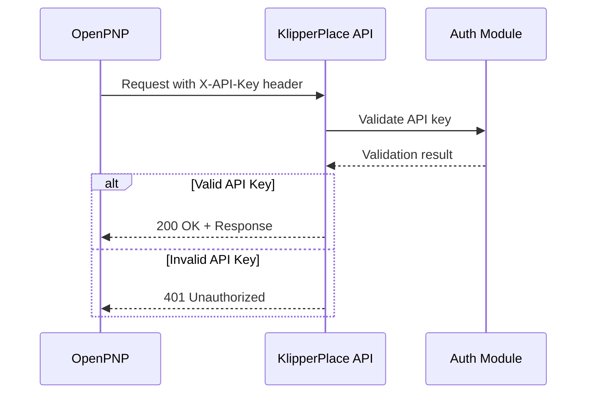
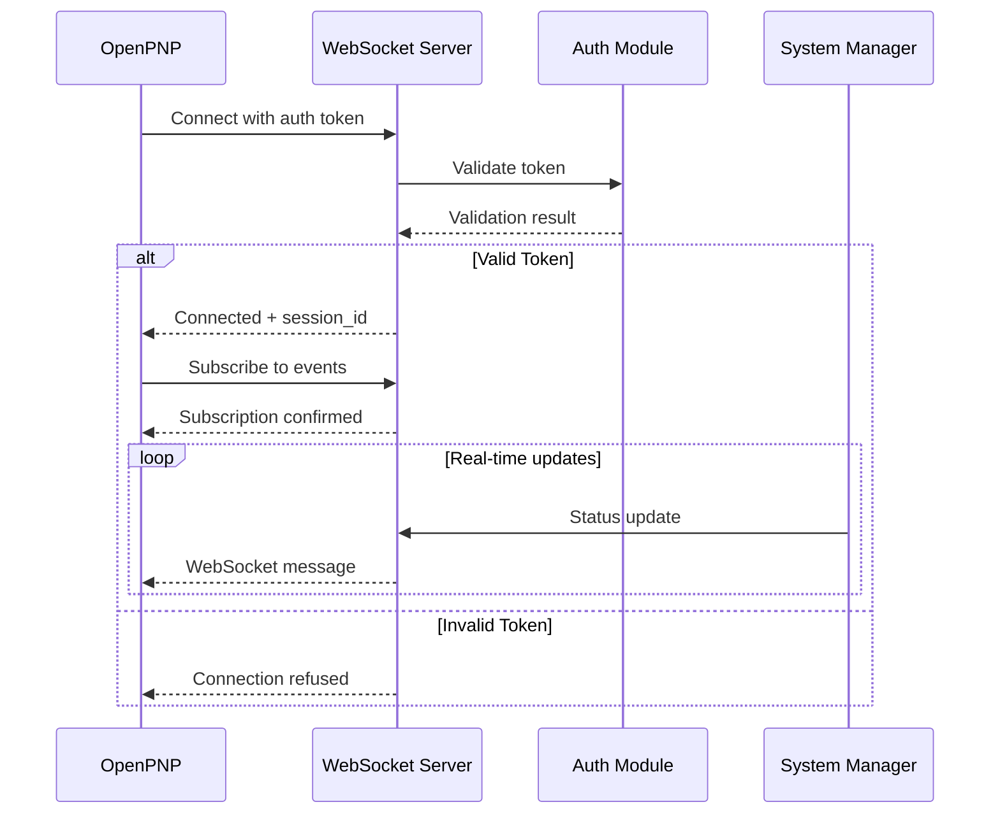

# KlipperPlace API Reference

Complete API reference documentation for KlipperPlace OpenPNP integration. This document provides detailed information about all REST endpoints, WebSocket connections, authentication, error handling, and usage examples.

## Table of Contents

- [Overview](#overview)
- [Getting Started](#getting-started)
- [Authentication](#authentication)
- [Rate Limiting](#rate-limiting)
- [REST API Endpoints](#rest-api-endpoints)
  - [Motion Commands](#motion-commands)
  - [Pick and Place Commands](#pick-and-place-commands)
  - [Actuator Commands](#actuator-commands)
  - [Vacuum Commands](#vacuum-commands)
  - [Fan Commands](#fan-commands)
  - [PWM Commands](#pwm-commands)
  - [GPIO Commands](#gpio-commands)
  - [Sensor Commands](#sensor-commands)
  - [Feeder Commands](#feeder-commands)
  - [Status Commands](#status-commands)
  - [Queue Commands](#queue-commands)
  - [System Commands](#system-commands)
  - [Batch Operations](#batch-operations)
  - [Version Information](#version-information)
- [WebSocket API](#websocket-api)
- [Error Handling](#error-handling)
- [Response Formats](#response-formats)
- [Usage Examples](#usage-examples)
- [Best Practices](#best-practices)
- [Security Considerations](#security-considerations)

---

## Overview

The KlipperPlace API provides a RESTful interface for controlling Klipper-based pick-and-place machines from OpenPNP. The API enables seamless integration between OpenPNP 2.0 and Klipper firmware through Moonraker.

### Base URL

```
http://localhost:7125/api/v1
```

### API Versioning

The API uses URL-based versioning to ensure backward compatibility:

- **Current Version**: v1
- **Version Format**: `/api/v{version}/`
- **Backward Compatibility**: All v1 endpoints will remain stable
- **Deprecation Policy**: Deprecated endpoints will be announced 90 days before removal

### Quick Start

1. **Configure Authentication** (optional for local networks)
2. **Make API Requests** with proper headers
3. **Handle Responses** using the unified response format
4. **Monitor Rate Limits** using response headers

---

## Getting Started

### Prerequisites

- Klipper firmware installed and running
- Moonraker installed and configured
- KlipperPlace API server running
- Network access to the API server

### Basic Request

```bash
curl -X POST http://localhost:7125/api/v1/motion/move \
  -H "Content-Type: application/json" \
  -H "X-API-Key: your-api-key" \
  -d '{"x": 100.0, "y": 50.0, "z": 10.0}'
```

### Response Format

All API responses follow a consistent format:

```json
{
  "status": "success",
  "command": "move",
  "command_id": "550e8400-e29b-41d4-a716-4466554400000",
  "data": {
    "position": {
      "x": 100.0,
      "y": 50.0,
      "z": 10.0
    },
    "execution_time": 0.125
  },
  "timestamp": 1640000000.000
}
```

---

## Authentication

The API supports optional API key authentication for secure deployments.

### API Key Authentication

#### Header Format

```
X-API-Key: <your-api-key>
```

#### Configuration

```ini
[api]
api_key_enabled: true
api_key: your-secure-api-key-here
```

#### Authentication Flow



#### No Authentication Mode

For local network deployments, authentication can be disabled:

```ini
[api]
api_key_enabled: false
```

In this mode, all requests are accepted without authentication.

#### Public Endpoints

The following endpoints are always public (no authentication required):

- `GET /api/v1/version` - Get API version information
- `GET /health` - Health check endpoint

---

## Rate Limiting

Basic rate limiting is implemented to prevent abuse.

### Rate Limits by Endpoint Type

| Endpoint Type | Rate Limit |
|--------------|-------------|
| Motion commands | 100 requests/second |
| GPIO/Sensor reads | 200 requests/second |
| Batch operations | 10 requests/second |
| WebSocket connections | 100 concurrent connections |

### Rate Limit Headers

All responses include rate limit information:

```
X-RateLimit-Limit: 100
X-RateLimit-Remaining: 95
X-RateLimit-Reset: 1640000000
X-RateLimit-Retry-After: 1
```

### Rate Limit Error Response

When rate limits are exceeded:

```json
{
  "status": "error",
  "command": "move",
  "command_id": "550e8400-e29b-41d4-a716-4466554400000",
  "error_code": "RATE_LIMIT_EXCEEDED",
  "error_message": "Rate limit exceeded. Please retry after 1 seconds.",
  "details": {
    "limit": 100,
    "window": "1 second",
    "retry_after": 1
  },
  "timestamp": 1640000000.000
}
```

### Handling Rate Limits

```python
import time
import requests

response = requests.post(url, json=data, headers=headers)

if response.status_code == 429:
    retry_after = int(response.headers.get('X-RateLimit-Retry-After', 1))
    time.sleep(retry_after)
    # Retry request
    response = requests.post(url, json=data, headers=headers)
```

---

## REST API Endpoints

### Motion Commands

#### POST /motion/move

Move the toolhead to specified coordinates.

**Request Body:**
```json
{
  "x": 100.5,
  "y": 50.2,
  "z": 10.0,
  "feedrate": 3000,
  "relative": false
}
```

**Parameters:**

| Parameter | Type | Required | Description |
|-----------|--------|----------|-------------|
| x | float | No | X coordinate in mm |
| y | float | No | Y coordinate in mm |
| z | float | No | Z coordinate in mm |
| feedrate | float | No | Feedrate in mm/min (default: from config) |
| relative | boolean | No | Use relative positioning (default: false) |

**Success Response (200):**
```json
{
  "status": "success",
  "command": "move",
  "command_id": "550e8400-e29b-41d4-a716-4466554400000",
  "data": {
    "position": {
      "x": 100.5,
      "y": 50.2,
      "z": 10.0
    },
    "execution_time": 0.125
  },
  "timestamp": 1640000000.000
}
```

**Error Response (400):**
```json
{
  "status": "error",
  "command": "move",
  "command_id": "550e8400-e29b-41d4-a716-4466554400000",
  "error_code": "POSITION_OUT_OF_BOUNDS",
  "error_message": "X position 350.0 mm exceeds maximum of 300.0 mm",
  "details": {
    "axis": "x",
    "position": 350.0,
    "max_limit": 300.0
  },
  "timestamp": 1640000000.000
}
```

**cURL Example:**
```bash
curl -X POST http://localhost:7125/api/v1/motion/move \
  -H "Content-Type: application/json" \
  -H "X-API-Key: your-api-key" \
  -d '{"x": 100.5, "y": 50.2, "z": 10.0, "feedrate": 3000}'
```

---

#### POST /motion/home

Home specified axes to establish coordinate system.

**Request Body:**
```json
{
  "axes": ["x", "y", "z"]
}
```

**Parameters:**

| Parameter | Type | Required | Description |
|-----------|--------|----------|-------------|
| axes | array | No | Axes to home (default: all) |

**Success Response (200):**
```json
{
  "status": "success",
  "command": "home",
  "command_id": "550e8400-e29b-41d4-a716-4466554400000",
  "data": {
    "homed_axes": ["x", "y", "z"],
    "execution_time": 2.5
  },
  "timestamp": 1640000000.000
}
```

**cURL Example:**
```bash
curl -X POST http://localhost:7125/api/v1/motion/home \
  -H "Content-Type: application/json" \
  -H "X-API-Key: your-api-key" \
  -d '{"axes": ["x", "y", "z"]}'
```

---

### Pick and Place Commands

#### POST /pnp/pick

Execute pick operation at current position.

**Request Body:**
```json
{
  "z": 0.5,
  "feedrate": 500,
  "vacuum_power": 255,
  "travel_height": 5.0
}
```

**Parameters:**

| Parameter | Type | Required | Description |
|-----------|--------|----------|-------------|
| z | float | No | Pick height in mm (default: 0.0) |
| feedrate | float | No | Feedrate in mm/min |
| vacuum_power | int | No | Vacuum power 0-255 (default: 255) |
| travel_height | float | No | Safe travel height in mm (default: 5.0) |

**Success Response (200):**
```json
{
  "status": "success",
  "command": "pick",
  "command_id": "550e8400-e29b-41d4-a716-4466554400000",
  "data": {
    "position": {
      "x": 100.0,
      "y": 50.0,
      "z": 0.5
    },
    "vacuum_enabled": true,
    "gcode": "G0 Z0.5 F500\nM106 S255\nG0 Z5.0",
    "execution_time": 0.75
  },
  "timestamp": 1640000000.000
}
```

**cURL Example:**
```bash
curl -X POST http://localhost:7125/api/v1/pnp/pick \
  -H "Content-Type: application/json" \
  -H "X-API-Key: your-api-key" \
  -d '{"z": 0.5, "feedrate": 500, "vacuum_power": 255}'
```

---

#### POST /pnp/place

Execute place operation at current position.

**Request Body:**
```json
{
  "z": 0.2,
  "feedrate": 500,
  "travel_height": 5.0
}
```

**Parameters:**

| Parameter | Type | Required | Description |
|-----------|--------|----------|-------------|
| z | float | No | Place height in mm (default: 0.0) |
| feedrate | float | No | Feedrate in mm/min |
| travel_height | float | No | Safe travel height in mm (default: 5.0) |

**Success Response (200):**
```json
{
  "status": "success",
  "command": "place",
  "command_id": "550e8400-e29b-41d4-a716-4466554400000",
  "data": {
    "position": {
      "x": 150.0,
      "y": 75.0,
      "z": 0.2
    },
    "vacuum_enabled": false,
    "gcode": "G0 Z0.2 F500\nM107\nG0 Z5.0",
    "execution_time": 0.75
  },
  "timestamp": 1640000000.000
}
```

**cURL Example:**
```bash
curl -X POST http://localhost:7125/api/v1/pnp/place \
  -H "Content-Type: application/json" \
  -H "X-API-Key: your-api-key" \
  -d '{"z": 0.2, "feedrate": 500}'
```

---

#### POST /pnp/pick_and_place

Execute complete pick and place operation.

**Request Body:**
```json
{
  "x": 100.0,
  "y": 50.0,
  "place_x": 150.0,
  "place_y": 75.0,
  "pick_height": 0.5,
  "place_height": 0.2,
  "safe_height": 10.0,
  "feedrate": 3000,
  "vacuum_power": 255
}
```

**Parameters:**

| Parameter | Type | Required | Description |
|-----------|--------|----------|-------------|
| x | float | Yes | Pick X coordinate in mm |
| y | float | Yes | Pick Y coordinate in mm |
| place_x | float | Yes | Place X coordinate in mm |
| place_y | float | Yes | Place Y coordinate in mm |
| pick_height | float | No | Pick height in mm (default: 0.0) |
| place_height | float | No | Place height in mm (default: 0.0) |
| safe_height | float | No | Safe travel height in mm (default: 10.0) |
| feedrate | float | No | Feedrate in mm/min |
| vacuum_power | int | No | Vacuum power 0-255 (default: 255) |

**Success Response (200):**
```json
{
  "status": "success",
  "command": "pick_and_place",
  "command_id": "550e8400-e29b-41d4-a716-4466554400000",
  "data": {
    "pick_position": {"x": 100.0, "y": 50.0, "z": 0.5},
    "place_position": {"x": 150.0, "y": 75.0, "z": 0.2},
    "vacuum_enabled": false,
    "gcode": "G0 Z10.0 F3000\nG0 X100.0 Y50.0 F3000\nG0 Z0.5 F3000\nM106 S255\nG0 Z10.0 F3000\nG0 X150.0 Y75.0 F3000\nG0 Z0.2 F3000\nM107\nG0 Z10.0 F3000",
    "execution_time": 2.5
  },
  "timestamp": 1640000000.000
}
```

**cURL Example:**
```bash
curl -X POST http://localhost:7125/api/v1/pnp/pick_and_place \
  -H "Content-Type: application/json" \
  -H "X-API-Key: your-api-key" \
  -d '{"x": 100.0, "y": 50.0, "place_x": 150.0, "place_y": 75.0, "safe_height": 10.0}'
```

---

### Actuator Commands

#### POST /actuators/actuate

Control an actuator (GPIO pin).

**Request Body:**
```json
{
  "pin": "PA0",
  "value": 1
}
```

**Parameters:**

| Parameter | Type | Required | Description |
|-----------|--------|----------|-------------|
| pin | string | Yes | GPIO pin name |
| value | int | No | Pin value 0 or 1 (default: 1) |

**Success Response (200):**
```json
{
  "status": "success",
  "command": "actuate",
  "command_id": "550e8400-e29b-41d4-a716-4466554400000",
  "data": {
    "pin": "PA0",
    "value": 1,
    "gcode": "SET_PIN PIN=PA0 VALUE=1",
    "execution_time": 0.01
  },
  "timestamp": 1640000000.000
}
```

**cURL Example:**
```bash
curl -X POST http://localhost:7125/api/v1/actuators/actuate \
  -H "Content-Type: application/json" \
  -H "X-API-Key: your-api-key" \
  -d '{"pin": "PA0", "value": 1}'
```

---

#### POST /actuators/on

Turn on an actuator.

**Request Body:**
```json
{
  "pin": "PA1"
}
```

**Success Response (200):**
```json
{
  "status": "success",
  "command": "actuator_on",
  "command_id": "550e8400-e29b-41d4-a716-4466554400000",
  "data": {
    "pin": "PA1",
    "value": 1,
    "gcode": "SET_PIN PIN=PA1 VALUE=1",
    "execution_time": 0.01
  },
  "timestamp": 1640000000.000
}
```

**cURL Example:**
```bash
curl -X POST http://localhost:7125/api/v1/actuators/on \
  -H "Content-Type: application/json" \
  -H "X-API-Key: your-api-key" \
  -d '{"pin": "PA1"}'
```

---

#### POST /actuators/off

Turn off an actuator.

**Request Body:**
```json
{
  "pin": "PA1"
}
```

**Success Response (200):**
```json
{
  "status": "success",
  "command": "actuator_off",
  "command_id": "550e8400-e29b-41d4-a716-4466554400000",
  "data": {
    "pin": "PA1",
    "value": 0,
    "gcode": "SET_PIN PIN=PA1 VALUE=0",
    "execution_time": 0.01
  },
  "timestamp": 1640000000.000
}
```

**cURL Example:**
```bash
curl -X POST http://localhost:7125/api/v1/actuators/off \
  -H "Content-Type: application/json" \
  -H "X-API-Key: your-api-key" \
  -d '{"pin": "PA1"}'
```

---

### Vacuum Commands

#### POST /vacuum/on

Enable vacuum pump.

**Request Body:**
```json
{
  "power": 255
}
```

**Parameters:**

| Parameter | Type | Required | Description |
|-----------|--------|----------|-------------|
| power | int | No | Vacuum power 0-255 (default: 255) |

**Success Response (200):**
```json
{
  "status": "success",
  "command": "vacuum_on",
  "command_id": "550e8400-e29b-41d4-a716-4466554400000",
  "data": {
    "power": 255,
    "gcode": "M106 S255",
    "execution_time": 0.01
  },
  "timestamp": 1640000000.000
}
```

**cURL Example:**
```bash
curl -X POST http://localhost:7125/api/v1/vacuum/on \
  -H "Content-Type: application/json" \
  -H "X-API-Key: your-api-key" \
  -d '{"power": 255}'
```

---

#### POST /vacuum/off

Disable vacuum pump.

**Success Response (200):**
```json
{
  "status": "success",
  "command": "vacuum_off",
  "command_id": "550e8400-e29b-41d4-a716-4466554400000",
  "data": {
    "gcode": "M107",
    "execution_time": 0.01
  },
  "timestamp": 1640000000.000
}
```

**cURL Example:**
```bash
curl -X POST http://localhost:7125/api/v1/vacuum/off \
  -H "Content-Type: application/json" \
  -H "X-API-Key: your-api-key"
```

---

#### POST /vacuum/set

Set vacuum power level.

**Request Body:**
```json
{
  "power": 128
}
```

**Parameters:**

| Parameter | Type | Required | Description |
|-----------|--------|----------|-------------|
| power | int | Yes | Vacuum power 0-255 |

**Success Response (200):**
```json
{
  "status": "success",
  "command": "vacuum_set",
  "command_id": "550e8400-e29b-41d4-a716-4466554400000",
  "data": {
    "power": 128,
    "gcode": "M106 S128",
    "execution_time": 0.01
  },
  "timestamp": 1640000000.000
}
```

**cURL Example:**
```bash
curl -X POST http://localhost:7125/api/v1/vacuum/set \
  -H "Content-Type: application/json" \
  -H "X-API-Key: your-api-key" \
  -d '{"power": 128}'
```

---

### Fan Commands

#### POST /fan/on

Enable fan at specified speed.

**Request Body:**
```json
{
  "fan": "fan",
  "speed": 0.5
}
```

**Parameters:**

| Parameter | Type | Required | Description |
|-----------|--------|----------|-------------|
| fan | string | No | Fan name (default: "fan") |
| speed | float | No | Fan speed 0.0-1.0 (default: 1.0) |

**Success Response (200):**
```json
{
  "status": "success",
  "command": "fan_on",
  "command_id": "550e8400-e29b-41d4-a716-4466554400000",
  "data": {
    "fan": "fan",
    "speed": 0.5,
    "gcode": "M106 S127",
    "execution_time": 0.01
  },
  "timestamp": 1640000000.000
}
```

**cURL Example:**
```bash
curl -X POST http://localhost:7125/api/v1/fan/on \
  -H "Content-Type: application/json" \
  -H "X-API-Key: your-api-key" \
  -d '{"fan": "fan", "speed": 0.5}'
```

---

#### POST /fan/off

Disable fan.

**Request Body:**
```json
{
  "fan": "fan"
}
```

**Parameters:**

| Parameter | Type | Required | Description |
|-----------|--------|----------|-------------|
| fan | string | No | Fan name (default: "fan") |

**Success Response (200):**
```json
{
  "status": "success",
  "command": "fan_off",
  "command_id": "550e8400-e29b-41d4-a716-4466554400000",
  "data": {
    "fan": "fan",
    "gcode": "M107",
    "execution_time": 0.01
  },
  "timestamp": 1640000000.000
}
```

**cURL Example:**
```bash
curl -X POST http://localhost:7125/api/v1/fan/off \
  -H "Content-Type: application/json" \
  -H "X-API-Key: your-api-key" \
  -d '{"fan": "fan"}'
```

---

#### POST /fan/set

Set fan speed.

**Request Body:**
```json
{
  "fan": "fan",
  "speed": 0.75
}
```

**Parameters:**

| Parameter | Type | Required | Description |
|-----------|--------|----------|-------------|
| fan | string | No | Fan name (default: "fan") |
| speed | float | Yes | Fan speed 0.0-1.0 |

**Success Response (200):**
```json
{
  "status": "success",
  "command": "fan_set",
  "command_id": "550e8400-e29b-41d4-a716-4466554400000",
  "data": {
    "fan": "fan",
    "speed": 0.75,
    "gcode": "M106 S191",
    "execution_time": 0.01
  },
  "timestamp": 1640000000.000
}
```

**cURL Example:**
```bash
curl -X POST http://localhost:7125/api/v1/fan/set \
  -H "Content-Type: application/json" \
  -H "X-API-Key: your-api-key" \
  -d '{"fan": "fan", "speed": 0.75}'
```

---

### PWM Commands

#### POST /pwm/set

Set PWM output value.

**Request Body:**
```json
{
  "pin": "PA2",
  "value": 0.5,
  "cycle_time": 0.01
}
```

**Parameters:**

| Parameter | Type | Required | Description |
|-----------|--------|----------|-------------|
| pin | string | Yes | PWM pin name |
| value | float | Yes | PWM value 0.0-1.0 |
| cycle_time | float | No | Cycle time in seconds (default: 0.01) |

**Success Response (200):**
```json
{
  "status": "success",
  "command": "pwm_set",
  "command_id": "550e8400-e29b-41d4-a716-4466554400000",
  "data": {
    "pin": "PA2",
    "value": 0.5,
    "cycle_time": 0.01,
    "execution_time": 0.01
  },
  "timestamp": 1640000000.000
}
```

**cURL Example:**
```bash
curl -X POST http://localhost:7125/api/v1/pwm/set \
  -H "Content-Type: application/json" \
  -H "X-API-Key: your-api-key" \
  -d '{"pin": "PA2", "value": 0.5}'
```

---

#### POST /pwm/ramp

Ramp PWM value over time.

**Request Body:**
```json
{
  "pin": "PA2",
  "start_value": 0.0,
  "end_value": 1.0,
  "duration": 2.0,
  "steps": 20
}
```

**Parameters:**

| Parameter | Type | Required | Description |
|-----------|--------|----------|-------------|
| pin | string | Yes | PWM pin name |
| start_value | float | Yes | Starting PWM value 0.0-1.0 |
| end_value | float | Yes | Ending PWM value 0.0-1.0 |
| duration | float | Yes | Ramp duration in seconds |
| steps | int | No | Number of steps (default: 10) |

**Success Response (200):**
```json
{
  "status": "success",
  "command": "pwm_ramp",
  "command_id": "550e8400-e29b-41d4-a716-4466554400000",
  "data": {
    "pin": "PA2",
    "start_value": 0.0,
    "end_value": 1.0,
    "duration": 2.0,
    "steps": 20,
    "execution_time": 2.0
  },
  "timestamp": 1640000000.000
}
```

**cURL Example:**
```bash
curl -X POST http://localhost:7125/api/v1/pwm/ramp \
  -H "Content-Type: application/json" \
  -H "X-API-Key: your-api-key" \
  -d '{"pin": "PA2", "start_value": 0.0, "end_value": 1.0, "duration": 2.0}'
```

---

### GPIO Commands

#### GET /gpio/read

Read GPIO pin state.

**Query Parameters:**

| Parameter | Type | Required | Description |
|-----------|--------|----------|-------------|
| pin | string | Yes | GPIO pin name |

**Example Request:**
```
GET /api/v1/gpio/read?pin=PB5
```

**Success Response (200):**
```json
{
  "status": "success",
  "command": "gpio_read",
  "command_id": "550e8400-e29b-41d4-a716-4466554400000",
  "data": {
    "pin": "PB5",
    "state": 1,
    "timestamp": 1640000000.000
  },
  "timestamp": 1640000000.000
}
```

**cURL Example:**
```bash
curl -X GET "http://localhost:7125/api/v1/gpio/read?pin=PB5" \
  -H "X-API-Key: your-api-key"
```

---

#### POST /gpio/write

Write GPIO pin state.

**Request Body:**
```json
{
  "pin": "PB6",
  "value": 1
}
```

**Parameters:**

| Parameter | Type | Required | Description |
|-----------|--------|----------|-------------|
| pin | string | Yes | GPIO pin name |
| value | int | Yes | Pin value 0 or 1 |

**Success Response (200):**
```json
{
  "status": "success",
  "command": "gpio_write",
  "command_id": "550e8400-e29b-41d4-a716-4466554400000",
  "data": {
    "pin": "PB6",
    "value": 1,
    "gcode": "SET_PIN PIN=PB6 VALUE=1",
    "execution_time": 0.01
  },
  "timestamp": 1640000000.000
}
```

**cURL Example:**
```bash
curl -X POST http://localhost:7125/api/v1/gpio/write \
  -H "Content-Type: application/json" \
  -H "X-API-Key: your-api-key" \
  -d '{"pin": "PB6", "value": 1}'
```

---

#### GET /gpio/read_all

Read all configured GPIO pin states.

**Success Response (200):**
```json
{
  "status": "success",
  "command": "gpio_read_all",
  "command_id": "550e8400-e29b-41d4-a716-4466554400000",
  "data": {
    "pins": {
      "PB5": 1,
      "PB6": 0,
      "PB7": 1,
      "PA0": 0,
      "PA1": 1
    },
    "count": 5
  },
  "timestamp": 1640000000.000
}
```

**cURL Example:**
```bash
curl -X GET http://localhost:7125/api/v1/gpio/read_all \
  -H "X-API-Key: your-api-key"
```

---

### Sensor Commands

#### GET /sensor/read

Read sensor value.

**Query Parameters:**

| Parameter | Type | Required | Description |
|-----------|--------|----------|-------------|
| sensor | string | Yes | Sensor name |

**Example Request:**
```
GET /api/v1/sensor/read?sensor=pressure_sensor
```

**Success Response (200):**
```json
{
  "status": "success",
  "command": "sensor_read",
  "command_id": "550e8400-e29b-41d4-a716-4466554400000",
  "data": {
    "sensor": "pressure_sensor",
    "value": 85.5,
    "unit": "kPa",
    "last_updated": 1640000000.000
  },
  "timestamp": 1640000000.000
}
```

**cURL Example:**
```bash
curl -X GET "http://localhost:7125/api/v1/sensor/read?sensor=pressure_sensor" \
  -H "X-API-Key: your-api-key"
```

---

#### GET /sensor/read_all

Read all configured sensor values.

**Success Response (200):**
```json
{
  "status": "success",
  "command": "sensor_read_all",
  "command_id": "550e8400-e29b-41d4-a716-4466554400000",
  "data": {
    "sensors": {
      "pressure_sensor": {
        "value": 85.5,
        "unit": "kPa",
        "last_updated": 1640000000.000
      },
      "vacuum_sensor": {
        "value": 0.92,
        "unit": "bar",
        "last_updated": 1640000000.000
      },
      "temperature_sensor": {
        "value": 25.3,
        "unit": "°C",
        "last_updated": 1640000000.000
      }
    },
    "count": 3
  },
  "timestamp": 1640000000.000
}
```

**cURL Example:**
```bash
curl -X GET http://localhost:7125/api/v1/sensor/read_all \
  -H "X-API-Key: your-api-key"
```

---

#### GET /sensor/read_by_type

Read all sensors of a specific type.

**Query Parameters:**

| Parameter | Type | Required | Description |
|-----------|--------|----------|-------------|
| type | string | Yes | Sensor type (pressure, vacuum, temperature, etc.) |

**Example Request:**
```
GET /api/v1/sensor/read_by_type?type=pressure
```

**Success Response (200):**
```json
{
  "status": "success",
  "command": "sensor_read_by_type",
  "command_id": "550e8400-e29b-41d4-a716-4466554400000",
  "data": {
    "type": "pressure",
    "sensors": {
      "pressure_sensor_1": {
        "value": 85.5,
        "unit": "kPa",
        "last_updated": 1640000000.000
      },
      "pressure_sensor_2": {
        "value": 87.2,
        "unit": "kPa",
        "last_updated": 1640000000.000
      }
    },
    "count": 2
  },
  "timestamp": 1640000000.000
}
```

**cURL Example:**
```bash
curl -X GET "http://localhost:7125/api/v1/sensor/read_by_type?type=pressure" \
  -H "X-API-Key: your-api-key"
```

---

### Feeder Commands

#### POST /feeder/advance

Advance feeder by specified distance.

**Request Body:**
```json
{
  "feeder": "feeder_1",
  "distance": 10.0,
  "feedrate": 100.0
}
```

**Parameters:**

| Parameter | Type | Required | Description |
|-----------|--------|----------|-------------|
| feeder | string | No | Feeder name (default: "feeder") |
| distance | float | Yes | Advance distance in mm |
| feedrate | float | No | Feedrate in mm/min (default: 100.0) |

**Success Response (200):**
```json
{
  "status": "success",
  "command": "feeder_advance",
  "command_id": "550e8400-e29b-41d4-a716-4466554400000",
  "data": {
    "feeder": "feeder_1",
    "distance": 10.0,
    "gcode": "G0 E10.0 F100.0",
    "execution_time": 0.5
  },
  "timestamp": 1640000000.000
}
```

**cURL Example:**
```bash
curl -X POST http://localhost:7125/api/v1/feeder/advance \
  -H "Content-Type: application/json" \
  -H "X-API-Key: your-api-key" \
  -d '{"feeder": "feeder_1", "distance": 10.0}'
```

---

#### POST /feeder/retract

Retract feeder by specified distance.

**Request Body:**
```json
{
  "feeder": "feeder_1",
  "distance": 10.0,
  "feedrate": 100.0
}
```

**Parameters:**

| Parameter | Type | Required | Description |
|-----------|--------|----------|-------------|
| feeder | string | No | Feeder name (default: "feeder") |
| distance | float | Yes | Retract distance in mm |
| feedrate | float | No | Feedrate in mm/min (default: 100.0) |

**Success Response (200):**
```json
{
  "status": "success",
  "command": "feeder_retract",
  "command_id": "550e8400-e29b-41d4-a716-4466554400000",
  "data": {
    "feeder": "feeder_1",
    "distance": 10.0,
    "gcode": "G0 E-10.0 F100.0",
    "execution_time": 0.5
  },
  "timestamp": 1640000000.000
}
```

**cURL Example:**
```bash
curl -X POST http://localhost:7125/api/v1/feeder/retract \
  -H "Content-Type: application/json" \
  -H "X-API-Key: your-api-key" \
  -d '{"feeder": "feeder_1", "distance": 10.0}'
```

---

### Status Commands

#### GET /status

Get comprehensive system status.

**Success Response (200):**
```json
{
  "status": "success",
  "command": "get_status",
  "command_id": "550e8400-e29b-41d4-a716-4466554400000",
  "data": {
    "printer_status": {
      "state": "ready",
      "klippy_connected": true,
      "moonraker_connected": true
    },
    "position": {
      "x": 100.5,
      "y": 50.2,
      "z": 10.0
    },
    "homed_axes": ["x", "y", "z"],
    "vacuum_enabled": false,
    "fan_speed": 0.5,
    "actuators": {
      "PA0": 1,
      "PA1": 0
    },
    "queue": {
      "size": 5,
      "executing": false
    }
  },
  "timestamp": 1640000000.000
}
```

**cURL Example:**
```bash
curl -X GET http://localhost:7125/api/v1/status \
  -H "X-API-Key: your-api-key"
```

---

#### GET /position

Get current toolhead position.

**Success Response (200):**
```json
{
  "status": "success",
  "command": "get_position",
  "command_id": "550e8400-e29b-41d4-a716-4466554400000",
  "data": {
    "position": {
      "x": 100.5,
      "y": 50.2,
      "z": 10.0
    },
    "positioning_mode": "absolute",
    "units": "mm"
  },
  "timestamp": 1640000000.000
}
```

**cURL Example:**
```bash
curl -X GET http://localhost:7125/api/v1/position \
  -H "X-API-Key: your-api-key"
```

---

#### GET /printer/state

Get printer state information.

**Success Response (200):**
```json
{
  "status": "success",
  "command": "get_printer_state",
  "command_id": "550e8400-e29b-41d4-a716-4466554400000",
  "data": {
    "klippy_state": "ready",
    "klippy_connected": true,
    "moonraker_connected": true,
    "print_stats": {
      "state": "idle",
      "print_duration": 0.0
    }
  },
  "timestamp": 1640000000.000
}
```

**cURL Example:**
```bash
curl -X GET http://localhost:7125/api/v1/printer/state \
  -H "X-API-Key: your-api-key"
```

---

### Queue Commands

#### POST /queue/add

Add a command to the execution queue.

**Request Body:**
```json
{
  "command": "move",
  "parameters": {
    "x": 100.0,
    "y": 50.0,
    "z": 10.0
  },
  "priority": 0
}
```

**Parameters:**

| Parameter | Type | Required | Description |
|-----------|--------|----------|-------------|
| command | string | Yes | Command name |
| parameters | object | No | Command parameters |
| priority | int | No | Command priority (default: 0) |

**Success Response (200):**
```json
{
  "status": "success",
  "command": "queue_add",
  "command_id": "550e8400-e29b-41d4-a716-4466554400000",
  "data": {
    "queue_id": "q-550e8400-e29b-41d4-a716-4466554400000",
    "queue_position": 5,
    "queue_size": 6
  },
  "timestamp": 1640000000.000
}
```

**cURL Example:**
```bash
curl -X POST http://localhost:7125/api/v1/queue/add \
  -H "Content-Type: application/json" \
  -H "X-API-Key: your-api-key" \
  -d '{"command": "move", "parameters": {"x": 100.0, "y": 50.0, "z": 10.0}}'
```

---

#### POST /queue/batch

Add multiple commands to the execution queue.

**Request Body:**
```json
{
  "commands": [
    {
      "command": "move",
      "parameters": {
        "x": 100.0,
        "y": 50.0
      }
    },
    {
      "command": "pick",
      "parameters": {
        "z": 0.5
      }
    },
    {
      "command": "move",
      "parameters": {
        "x": 150.0,
        "y": 75.0
      }
    },
    {
      "command": "place",
      "parameters": {
        "z": 0.2
      }
    }
  ],
  "stop_on_error": true
}
```

**Parameters:**

| Parameter | Type | Required | Description |
|-----------|--------|----------|-------------|
| commands | array | Yes | Array of command objects |
| stop_on_error | boolean | No | Stop on first error (default: true) |

**Success Response (200):**
```json
{
  "status": "success",
  "command": "queue_batch",
  "command_id": "550e8400-e29b-41d4-a716-4466554400000",
  "data": {
    "queue_ids": [
      "q-550e8400-e29b-41d4-a716-446655440-0001",
      "q-550e8400-e29b-41d4-a716-446655440-0002",
      "q-550e8400-e29b-41d4-a716-446655440-0003",
      "q-550e8400-e29b-41d4-a716-446655440-0004"
    ],
    "queue_size": 9
  },
  "timestamp": 1640000000.000
}
```

**cURL Example:**
```bash
curl -X POST http://localhost:7125/api/v1/queue/batch \
  -H "Content-Type: application/json" \
  -H "X-API-Key: your-api-key" \
  -d '{"commands": [{"command": "move", "parameters": {"x": 100.0, "y": 50.0}}]}'
```

---

#### GET /queue/status

Get current queue status.

**Success Response (200):**
```json
{
  "status": "success",
  "command": "queue_status",
  "command_id": "550e8400-e29b-41d4-a716-4466554400000",
  "data": {
    "queue_size": 5,
    "executing": true,
    "current_command": {
      "id": "q-550e8400-e29b-41d4-a716-446655440-0003",
      "command": "pick",
      "status": "executing"
    },
    "queued_commands": [
      {
        "id": "q-550e8400-e29b-41d4-a716-446655440-0004",
        "command": "move",
        "status": "pending"
      },
      {
        "id": "q-550e8400-e29b-41d4-a716-446655440-0005",
        "command": "place",
        "status": "pending"
      }
    ]
  },
  "timestamp": 1640000000.000
}
```

**cURL Example:**
```bash
curl -X GET http://localhost:7125/api/v1/queue/status \
  -H "X-API-Key: your-api-key"
```

---

#### DELETE /queue/clear

Clear all commands from the queue.

**Success Response (200):**
```json
{
  "status": "success",
  "command": "queue_clear",
  "command_id": "550e8400-e29b-41d4-a716-4466554400000",
  "data": {
    "cleared_count": 5,
    "message": "Queue cleared successfully"
  },
  "timestamp": 1640000000.000
}
```

**cURL Example:**
```bash
curl -X DELETE http://localhost:7125/api/v1/queue/clear \
  -H "X-API-Key: your-api-key"
```

---

#### DELETE /queue/cancel

Cancel a specific queued command.

**Request Body:**
```json
{
  "queue_id": "q-550e8400-e29b-41d4-a716-446655440-0003"
}
```

**Parameters:**

| Parameter | Type | Required | Description |
|-----------|--------|----------|-------------|
| queue_id | string | Yes | Queue command ID to cancel |

**Success Response (200):**
```json
{
  "status": "success",
  "command": "queue_cancel",
  "command_id": "550e8400-e29b-41d4-a716-4466554400000",
  "data": {
    "cancelled_id": "q-550e8400-e29b-41d4-a716-446655440-0003",
    "message": "Command cancelled successfully"
  },
  "timestamp": 1640000000.000
}
```

**cURL Example:**
```bash
curl -X DELETE http://localhost:7125/api/v1/queue/cancel \
  -H "Content-Type: application/json" \
  -H "X-API-Key: your-api-key" \
  -d '{"queue_id": "q-550e8400-e29b-41d4-a716-446655440-0003"}'
```

---

### System Commands

#### POST /system/emergency_stop

Execute emergency stop.

**Request Body:**
```json
{
  "reason": "Manual emergency stop triggered"
}
```

**Parameters:**

| Parameter | Type | Required | Description |
|-----------|--------|----------|-------------|
| reason | string | No | Reason for emergency stop |

**Success Response (200):**
```json
{
  "status": "success",
  "command": "emergency_stop",
  "command_id": "550e8400-e29b-41d4-a716-4466554400000",
  "data": {
    "emergency_stop_active": true,
    "reason": "Manual emergency stop triggered",
    "gcode_sent": "M112"
  },
  "timestamp": 1640000000.000
}
```

**cURL Example:**
```bash
curl -X POST http://localhost:7125/api/v1/system/emergency_stop \
  -H "Content-Type: application/json" \
  -H "X-API-Key: your-api-key" \
  -d '{"reason": "Manual emergency stop triggered"}'
```

---

#### POST /system/pause

Pause current execution.

**Success Response (200):**
```json
{
  "status": "success",
  "command": "pause",
  "command_id": "550e8400-e29b-41d4-a716-4466554400000",
  "data": {
    "paused": true,
    "message": "Execution paused"
  },
  "timestamp": 1640000000.000
}
```

**cURL Example:**
```bash
curl -X POST http://localhost:7125/api/v1/system/pause \
  -H "X-API-Key: your-api-key"
```

---

#### POST /system/resume

Resume paused execution.

**Success Response (200):**
```json
{
  "status": "success",
  "command": "resume",
  "command_id": "550e8400-e29b-41d4-a716-4466554400000",
  "data": {
    "resumed": true,
    "message": "Execution resumed"
  },
  "timestamp": 1640000000.000
}
```

**cURL Example:**
```bash
curl -X POST http://localhost:7125/api/v1/system/resume \
  -H "X-API-Key: your-api-key"
```

---

#### POST /system/reset

Reset system state.

**Success Response (200):**
```json
{
  "status": "success",
  "command": "reset",
  "command_id": "550e8400-e29b-41d4-a716-4466554400000",
  "data": {
    "reset_complete": true,
    "message": "System reset successfully"
  },
  "timestamp": 1640000000.000
}
```

**cURL Example:**
```bash
curl -X POST http://localhost:7125/api/v1/system/reset \
  -H "X-API-Key: your-api-key"
```

---

### Batch Operations

#### POST /batch/execute

Execute multiple commands in a single request.

**Request Body:**
```json
{
  "commands": [
    {
      "command": "move",
      "parameters": {
        "x": 100.0,
        "y": 50.0
      }
    },
    {
      "command": "pick",
      "parameters": {
        "z": 0.5
      }
    },
    {
      "command": "move",
      "parameters": {
        "x": 150.0,
        "y": 75.0
      }
    },
    {
      "command": "place",
      "parameters": {
        "z": 0.2
      }
    }
  ],
  "stop_on_error": true,
  "parallel": false
}
```

**Parameters:**

| Parameter | Type | Required | Description |
|-----------|--------|----------|-------------|
| commands | array | Yes | Array of command objects |
| stop_on_error | boolean | No | Stop on first error (default: true) |
| parallel | boolean | No | Execute in parallel (default: false) |

**Success Response (200):**
```json
{
  "status": "success",
  "command": "batch_execute",
  "command_id": "550e8400-e29b-41d4-a716-4466554400000",
  "data": {
    "results": [
      {
        "command": "move",
        "status": "success",
        "execution_time": 0.125
      },
      {
        "command": "pick",
        "status": "success",
        "execution_time": 0.75
      },
      {
        "command": "move",
        "status": "success",
        "execution_time": 0.125
      },
      {
        "command": "place",
        "status": "success",
        "execution_time": 0.75
      }
    ],
    "total_execution_time": 1.75,
    "success_count": 4,
    "error_count": 0
  },
  "timestamp": 1640000000.000
}
```

**cURL Example:**
```bash
curl -X POST http://localhost:7125/api/v1/batch/execute \
  -H "Content-Type: application/json" \
  -H "X-API-Key: your-api-key" \
  -d '{"commands": [{"command": "move", "parameters": {"x": 100.0, "y": 50.0}}]}'
```

---

### Version Information

#### GET /version

Get API version information.

**Success Response (200):**
```json
{
  "api_version": "1.0.0",
  "server_version": "1.0.0",
  "supported_versions": ["v1"],
  "latest_version": "v1",
  "deprecation_notices": []
}
```

**cURL Example:**
```bash
curl -X GET http://localhost:7125/api/v1/version
```

---

## WebSocket API

The WebSocket API provides real-time event notifications and command execution capabilities.

### Connection

**Endpoint:** `ws://localhost:7125/ws/v1`

### Connection Flow



### Message Format

All WebSocket messages follow JSON-RPC 2.0 format.

#### Client Request Format

```json
{
  "jsonrpc": "2.0",
  "method": "subscribe",
  "params": {
    "events": ["position", "sensors", "queue", "status"]
  },
  "id": 1
}
```

#### Server Response Format

```json
{
  "jsonrpc": "2.0",
  "result": {
    "subscribed": true,
    "events": ["position", "sensors", "queue", "status"]
  },
  "id": 1
}
```

### WebSocket Methods

#### subscribe

Subscribe to real-time event notifications.

**Request:**
```json
{
  "jsonrpc": "2.0",
  "method": "subscribe",
  "params": {
    "events": ["position", "sensors", "queue", "status", "gpio", "actuators"]
  },
  "id": 1
}
```

**Available Events:**

| Event | Description |
|--------|-------------|
| position | Toolhead position updates |
| sensors | Sensor value updates |
| queue | Queue status changes |
| status | System status changes |
| gpio | GPIO state changes |
| actuators | Actuator state changes |
| safety | Safety events and warnings |

**Response:**
```json
{
  "jsonrpc": "2.0",
  "result": {
    "subscribed": true,
    "events": ["position", "sensors", "queue", "status", "gpio", "actuators", "safety"]
  },
  "id": 1
}
```

---

#### unsubscribe

Unsubscribe from event notifications.

**Request:**
```json
{
  "jsonrpc": "2.0",
  "method": "unsubscribe",
  "params": {
    "events": ["position", "sensors"]
  },
  "id": 2
}
```

**Response:**
```json
{
  "jsonrpc": "2.0",
  "result": {
    "unsubscribed": true,
    "events": ["position", "sensors"]
  },
  "id": 2
}
```

---

#### execute

Execute a command through WebSocket connection.

**Request:**
```json
{
  "jsonrpc": "2.0",
  "method": "execute",
  "params": {
    "command": "move",
    "parameters": {
      "x": 100.0,
      "y": 50.0,
      "z": 10.0
    }
  },
  "id": 3
}
```

**Response:**
```json
{
  "jsonrpc": "2.0",
  "result": {
    "status": "success",
    "command": "move",
    "command_id": "550e8400-e29b-41d4-a716-4466554400000",
    "data": {
      "position": {
        "x": 100.0,
        "y": 50.0,
        "z": 10.0
      },
      "execution_time": 0.125
    }
  },
  "id": 3
}
```

### WebSocket Event Notifications

#### notify_position_update

Position changed event.

```json
{
  "jsonrpc": "2.0",
  "method": "notify_position_update",
  "params": {
    "position": {
      "x": 100.5,
      "y": 50.2,
      "z": 10.0
    },
    "timestamp": 1640000000.000
  }
}
```

---

#### notify_sensor_update

Sensor values changed event.

```json
{
  "jsonrpc": "2.0",
  "method": "notify_sensor_update",
  "params": {
    "sensors": {
      "pressure_sensor": {
        "value": 85.5,
        "unit": "kPa",
        "last_updated": 1640000000.000
      },
      "vacuum_sensor": {
        "value": 0.92,
        "unit": "bar",
        "last_updated": 1640000000.000
      }
    },
    "timestamp": 1640000000.000
  }
}
```

---

#### notify_queue_update

Queue status changed event.

```json
{
  "jsonrpc": "2.0",
  "method": "notify_queue_update",
  "params": {
    "queue_size": 5,
    "executing": true,
    "current_command": {
      "id": "q-550e8400-e29b-41d4-a716-446655440-0003",
      "command": "pick",
      "status": "executing"
    },
    "timestamp": 1640000000.000
  }
}
```

---

#### notify_status_update

System status changed event.

```json
{
  "jsonrpc": "2.0",
  "method": "notify_status_update",
  "params": {
    "printer_status": {
      "state": "ready",
      "klippy_connected": true,
      "moonraker_connected": true
    },
    "timestamp": 1640000000.000
  }
}
```

---

#### notify_gpio_update

GPIO states changed event.

```json
{
  "jsonrpc": "2.0",
  "method": "notify_gpio_update",
  "params": {
    "pins": {
      "PB5": 1,
      "PB6": 0,
      "PB7": 1
    },
    "timestamp": 1640000000.000
  }
}
```

---

#### notify_safety_event

Safety event occurred.

```json
{
  "jsonrpc": "2.0",
  "method": "notify_safety_event",
  "params": {
    "event_type": "position_limit_exceeded",
    "level": "critical",
    "message": "X position out of bounds: 350.0 mm",
    "details": {
      "axis": "x",
      "position": 350.0,
      "max_limit": 300.0
    },
    "component": "axis_x",
    "timestamp": 1640000000.000
  }
}
```

---

## Error Handling

### Error Response Format

All errors follow a consistent format:

```json
{
  "status": "error",
  "command": "move",
  "command_id": "550e8400-e29b-41d4-a716-4466554400000",
  "error_code": "POSITION_OUT_OF_BOUNDS",
  "error_message": "X position 350.0 mm exceeds maximum of 300.0 mm",
  "details": {
    "axis": "x",
    "position": 350.0,
    "max_limit": 300.0
  },
  "warnings": [],
  "timestamp": 1640000000.000
}
```

### Error Response Fields

| Field | Type | Description |
|--------|------|-------------|
| status | string | Always "error" |
| command | string | Command that failed |
| command_id | string | Unique command identifier |
| error_code | string | Machine-readable error code |
| error_message | string | Human-readable error message |
| details | object | Additional error details |
| warnings | array | Warning messages |
| timestamp | float | Unix timestamp |

### Error Codes

| Error Code | HTTP Status | Description |
|------------|--------------|-------------|
| AUTHENTICATION_FAILED | 401 | API key authentication failed |
| AUTHORIZATION_REQUIRED | 401 | API key required but not provided |
| INVALID_API_KEY | 401 | Invalid API key provided |
| IP_BLOCKED | 429 | IP blocked due to too many failed attempts |
| RATE_LIMIT_EXCEEDED | 429 | Rate limit exceeded |
| INVALID_REQUEST | 400 | Invalid request format or parameters |
| MISSING_PARAMETER | 400 | Required parameter missing |
| INVALID_PARAMETER | 400 | Invalid parameter value |
| POSITION_OUT_OF_BOUNDS | 400 | Position exceeds limits |
| FEEDRATE_OUT_OF_BOUNDS | 400 | Feedrate exceeds limits |
| PWM_OUT_OF_BOUNDS | 400 | PWM value out of range |
| FAN_SPEED_OUT_OF_BOUNDS | 400 | Fan speed out of range |
| TEMPERATURE_OUT_OF_BOUNDS | 400 | Temperature exceeds limits |
| HOMING_REQUIRED | 400 | Axis must be homed first |
| QUEUE_FULL | 429 | Command queue is full |
| COMMAND_NOT_FOUND | 404 | Command not found |
| EXECUTION_FAILED | 500 | Command execution failed |
| MOONRAKER_DISCONNECTED | 503 | Moonraker not connected |
| KLIPPY_DISCONNECTED | 503 | Klipper not connected |
| EMERGENCY_STOP_ACTIVE | 503 | Emergency stop is active |
| INTERNAL_ERROR | 500 | Internal server error |
| TIMEOUT | 504 | Command execution timeout |

### HTTP Status Codes

| Status Code | Description |
|-------------|-------------|
| 200 | OK - Request successful |
| 400 | Bad Request - Invalid request |
| 401 | Unauthorized - Authentication failed |
| 404 | Not Found - Resource not found |
| 429 | Too Many Requests - Rate limit exceeded |
| 500 | Internal Server Error - Server error |
| 503 | Service Unavailable - Service down |
| 504 | Gateway Timeout - Request timeout |

---

## Response Formats

### Success Response

```json
{
  "status": "success",
  "command": "move",
  "command_id": "550e8400-e29b-41d4-a716-4466554400000",
  "data": {
    "position": {
      "x": 100.5,
      "y": 50.2,
      "z": 10.0
    },
    "execution_time": 0.125
  },
  "warnings": [],
  "timestamp": 1640000000.000
}
```

### Partial Success Response

```json
{
  "status": "partial",
  "command": "batch_execute",
  "command_id": "550e8400-e29b-41d4-a716-4466554400000",
  "data": {
    "results": [
      {
        "command": "move",
        "status": "success"
      },
      {
        "command": "pick",
        "status": "error",
        "error_code": "VACUUM_FAILED"
      }
    ],
    "success_count": 1,
    "error_count": 1
  },
  "error_message": "Batch completed with errors",
  "warnings": [
    "Command 2 of 2 failed: pick"
  ],
  "timestamp": 1640000000.000
}
```

### Timeout Response

```json
{
  "status": "timeout",
  "command": "move",
  "command_id": "550e8400-e29b-41d4-a716-4466554400000",
  "error_message": "Command execution timed out after 30.0 seconds",
  "error_code": "TIMEOUT",
  "details": {
    "timeout": 30.0,
    "elapsed": 30.0
  },
  "timestamp": 1640000000.000
}
```

### Cancelled Response

```json
{
  "status": "cancelled",
  "command": "move",
  "command_id": "550e8400-e29b-41d4-a716-4466554400000",
  "error_message": "Command cancelled by user",
  "error_code": "CANCELLED",
  "details": {
    "cancelled_by": "user"
  },
  "timestamp": 1640000000.000
}
```

---

## Usage Examples

### Python Example

```python
import requests
import json

# Configure API
BASE_URL = "http://localhost:7125/api/v1"
API_KEY = "your-api-key"

headers = {
    "X-API-Key": API_KEY,
    "Content-Type": "application/json"
}

# Move command
move_request = {
    "x": 100.0,
    "y": 50.0,
    "z": 10.0,
    "feedrate": 3000
}

response = requests.post(
    f"{BASE_URL}/motion/move",
    json=move_request,
    headers=headers
)

print(response.json())

# Pick and place
pick_place_request = {
    "x": 100.0,
    "y": 50.0,
    "place_x": 150.0,
    "place_y": 75.0,
    "pick_height": 0.5,
    "place_height": 0.2,
    "safe_height": 10.0
}

response = requests.post(
    f"{BASE_URL}/pnp/pick_and_place",
    json=pick_place_request,
    headers=headers
)

print(response.json())
```

### JavaScript Example

```javascript
const BASE_URL = "http://localhost:7125/api/v1";
const API_KEY = "your-api-key";

const headers = {
    "X-API-Key": API_KEY,
    "Content-Type": "application/json"
};

// Move command
async function move(x, y, z, feedrate) {
    const response = await fetch(`${BASE_URL}/motion/move`, {
        method: 'POST',
        headers: headers,
        body: JSON.stringify({ x, y, z, feedrate })
    });
    return await response.json();
}

// Pick and place
async function pickAndPlace(params) {
    const response = await fetch(`${BASE_URL}/pnp/pick_and_place`, {
        method: 'POST',
        headers: headers,
        body: JSON.stringify(params)
    });
    return await response.json();
}

// Usage
move(100.0, 50.0, 10.0, 3000)
    .then(result => console.log(result))
    .catch(error => console.error(error));
```

### C# Example

```csharp
using System;
using System.Net.Http;
using System.Text;
using System.Threading.Tasks;
using Newtonsoft.Json;

public class KlipperPlaceClient
{
    private readonly HttpClient _httpClient;
    private const string BaseUrl = "http://localhost:7125/api/v1";
    private readonly string _apiKey;

    public KlipperPlaceClient(string apiKey)
    {
        _httpClient = new HttpClient();
        _apiKey = apiKey;
        _httpClient.DefaultRequestHeaders.Add("X-API-Key", apiKey);
    }

    public async Task<dynamic> MoveAsync(double x, double y, double z, double feedrate)
    {
        var request = new
        {
            x,
            y,
            z,
            feedrate
        };

        var content = new StringContent(
            JsonConvert.SerializeObject(request),
            Encoding.UTF8,
            "application/json"
        );

        var response = await _httpClient.PostAsync($"{BaseUrl}/motion/move", content);
        var responseContent = await response.Content.ReadAsStringAsync();
        return JsonConvert.DeserializeObject<dynamic>(responseContent);
    }

    public async Task<dynamic> PickAndPlaceAsync(double x, double y, double placeX, double placeY)
    {
        var request = new
        {
            x,
            y,
            place_x = placeX,
            place_y = placeY,
            safe_height = 10.0
        };

        var content = new StringContent(
            JsonConvert.SerializeObject(request),
            Encoding.UTF8,
            "application/json"
        );

        var response = await _httpClient.PostAsync($"{BaseUrl}/pnp/pick_and_place", content);
        var responseContent = await response.Content.ReadAsStringAsync();
        return JsonConvert.DeserializeObject<dynamic>(responseContent);
    }
}

// Usage
var client = new KlipperPlaceClient("your-api-key");
var result = await client.MoveAsync(100.0, 50.0, 10.0, 3000);
Console.WriteLine(result);
```

### WebSocket Example (Python)

```python
import asyncio
import websockets
import json

async def websocket_client():
    uri = "ws://localhost:7125/ws/v1"
    
    async with websockets.connect(uri) as websocket:
        # Subscribe to events
        subscribe_msg = {
            "jsonrpc": "2.0",
            "method": "subscribe",
            "params": {
                "events": ["position", "sensors", "queue", "status"]
            },
            "id": 1
        }
        await websocket.send(json.dumps(subscribe_msg))
        
        # Listen for messages
        async for message in websocket:
            data = json.loads(message)
            print(f"Received: {data}")

asyncio.run(websocket_client())
```

### WebSocket Example (JavaScript)

```javascript
const WS_URL = "ws://localhost:7125/ws/v1";

const ws = new WebSocket(WS_URL);

ws.onopen = () => {
    console.log('WebSocket connected');
    
    // Subscribe to events
    const subscribeMsg = {
        jsonrpc: "2.0",
        method: "subscribe",
        params: {
            events: ["position", "sensors", "queue", "status"]
        },
        id: 1
    };
    ws.send(JSON.stringify(subscribeMsg));
};

ws.onmessage = (event) => {
    const data = JSON.parse(event.data);
    console.log('Received:', data);
    
    // Handle position updates
    if (data.method === 'notify_position_update') {
        console.log('Position:', data.params.position);
    }
    
    // Handle sensor updates
    if (data.method === 'notify_sensor_update') {
        console.log('Sensors:', data.params.sensors);
    }
};

ws.onerror = (error) => {
    console.error('WebSocket error:', error);
};

ws.onclose = () => {
    console.log('WebSocket disconnected');
};
```

---

## Best Practices

### Error Handling

Always check the `status` field in responses:

```python
response = api_call(command)

if response['status'] == 'success':
    # Handle success
    handle_success(response['data'])
elif response['status'] == 'error':
    # Handle error
    handle_error(response['error_code'], response['error_message'])
elif response['status'] == 'partial':
    # Handle partial success
    handle_partial(response['data'])
```

### Command ID Tracking

Always track `command_id` for debugging and tracing:

```python
command_id = response['command_id']
log_command(command_id, command, parameters)
```

### Timeout Handling

Implement appropriate timeout handling for long-running commands:

```python
try:
    response = api_call(command, timeout=30.0)
except TimeoutError:
    # Handle timeout
    handle_timeout(command)
```

### WebSocket Reconnection

Implement automatic reconnection logic:

```javascript
let reconnectAttempts = 0;
const MAX_RECONNECT_ATTEMPTS = 5;
const RECONNECT_DELAY = 5000;

function connectWebSocket() {
    ws = new WebSocket(WS_URL);
    
    ws.onclose = () => {
        if (reconnectAttempts < MAX_RECONNECT_ATTEMPTS) {
            reconnectAttempts++;
            setTimeout(connectWebSocket, RECONNECT_DELAY);
        }
    };
}

connectWebSocket();
```

### Rate Limit Handling

Respect rate limit headers:

```python
response = api_call(command)

if response.status_code == 429:
    retry_after = int(response.headers.get('X-RateLimit-Retry-After', 60))
    time.sleep(retry_after)
    # Retry request
    response = api_call(command)
```

---

## Security Considerations

### API Key Security

- Use strong, randomly generated API keys
- Rotate API keys regularly
- Never expose API keys in client-side code
- Use environment variables for API key storage

### Input Validation

- Validate all input parameters before sending
- Sanitize pin names and sensor names
- Limit G-code queue size to prevent DoS
- Implement bounds checking on client side

### Network Security

- Use HTTPS in production deployments
- Implement firewall rules to restrict access
- Monitor for suspicious activity patterns
- Implement IP-based rate limiting

### WebSocket Security

- Validate authentication on connection
- Implement message size limits
- Monitor for abnormal connection patterns
- Implement connection rate limiting

---

## Appendix

### Complete Endpoint List

| Category | Endpoint | Method | Description |
|-----------|-----------|--------|-------------|
| Motion | /motion/move | POST | Move to position |
| Motion | /motion/home | POST | Home axes |
| PnP | /pnp/pick | POST | Pick component |
| PnP | /pnp/place | POST | Place component |
| PnP | /pnp/pick_and_place | POST | Pick and place |
| Actuators | /actuators/actuate | POST | Control actuator |
| Actuators | /actuators/on | POST | Turn on actuator |
| Actuators | /actuators/off | POST | Turn off actuator |
| Vacuum | /vacuum/on | POST | Enable vacuum |
| Vacuum | /vacuum/off | POST | Disable vacuum |
| Vacuum | /vacuum/set | POST | Set vacuum power |
| Fan | /fan/on | POST | Enable fan |
| Fan | /fan/off | POST | Disable fan |
| Fan | /fan/set | POST | Set fan speed |
| PWM | /pwm/set | POST | Set PWM value |
| PWM | /pwm/ramp | POST | Ramp PWM value |
| GPIO | /gpio/read | GET | Read GPIO pin |
| GPIO | /gpio/write | POST | Write GPIO pin |
| GPIO | /gpio/read_all | GET | Read all GPIO |
| Sensor | /sensor/read | GET | Read sensor |
| Sensor | /sensor/read_all | GET | Read all sensors |
| Sensor | /sensor/read_by_type | GET | Read sensors by type |
| Feeder | /feeder/advance | POST | Advance feeder |
| Feeder | /feeder/retract | POST | Retract feeder |
| Status | /status | GET | Get system status |
| Status | /position | GET | Get position |
| Status | /printer/state | GET | Get printer state |
| Queue | /queue/add | POST | Add to queue |
| Queue | /queue/batch | POST | Batch add to queue |
| Queue | /queue/status | GET | Get queue status |
| Queue | /queue/clear | DELETE | Clear queue |
| Queue | /queue/cancel | DELETE | Cancel command |
| System | /system/emergency_stop | POST | Emergency stop |
| System | /system/pause | POST | Pause execution |
| System | /system/resume | POST | Resume execution |
| System | /system/reset | POST | Reset system |
| Batch | /batch/execute | POST | Execute batch |
| Version | /version | GET | Get API version |

### WebSocket Methods

| Method | Description |
|--------|-------------|
| subscribe | Subscribe to events |
| unsubscribe | Unsubscribe from events |
| execute | Execute command via WebSocket |

### WebSocket Events

| Event | Description |
|--------|-------------|
| notify_position_update | Position changed |
| notify_sensor_update | Sensor values changed |
| notify_queue_update | Queue status changed |
| notify_status_update | System status changed |
| notify_gpio_update | GPIO states changed |
| notify_actuators_update | Actuator states changed |
| notify_safety_event | Safety event occurred |

---

## Changelog

### Version 1.0.0 (2024-01-13)

- Initial API release
- Complete REST endpoint definitions (32 endpoints)
- WebSocket endpoint specifications
- Error handling format
- Authentication mechanism
- Rate limiting support
- API versioning strategy

---

## Support

For issues, questions, or contributions, please visit:

- **GitHub Repository**: https://github.com/klipperplace
- **Documentation**: [`docs/ARCHITECTURE.md`](ARCHITECTURE.md)
- **Testing Guide**: [`docs/TESTING.md`](TESTING.md)

---

**Document Version**: 1.0.0  
**Last Updated**: 2024-01-13  
**API Version**: v1.0.0
