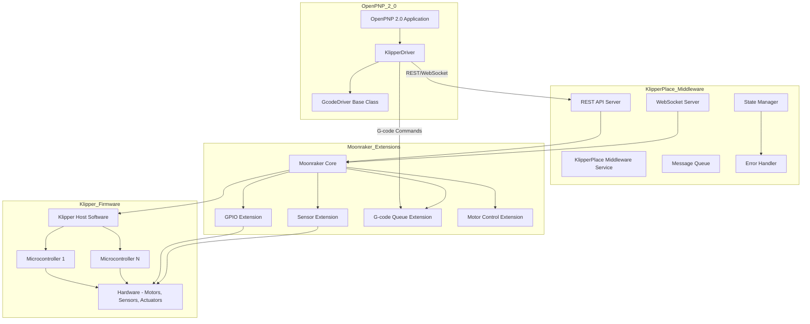
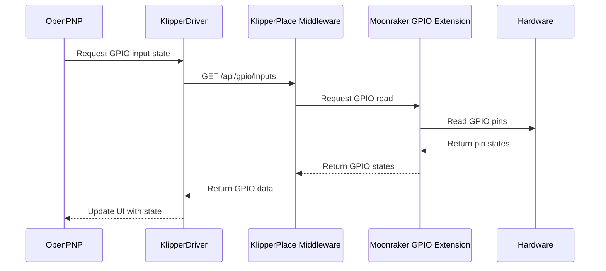
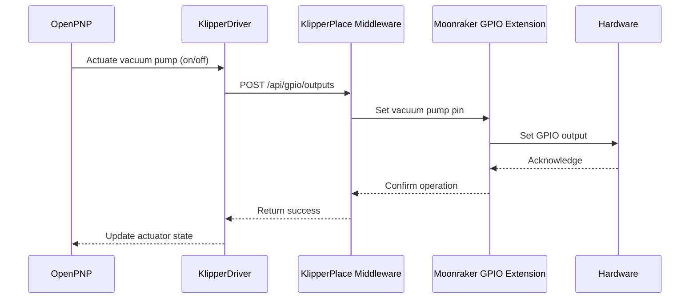
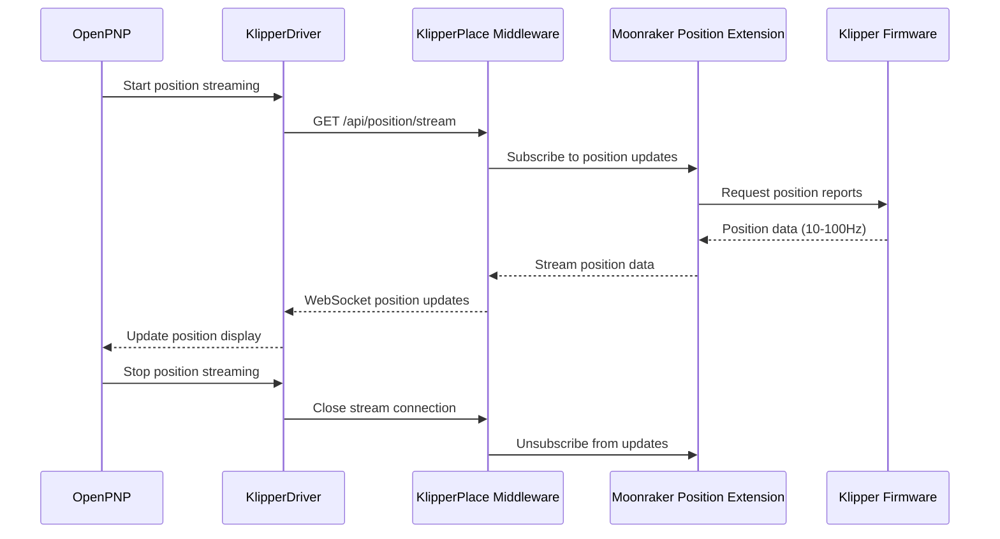
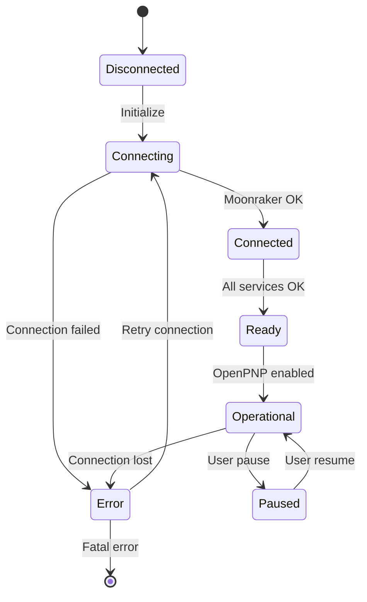
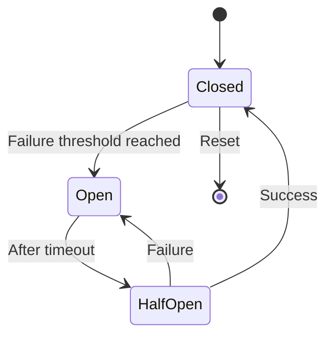
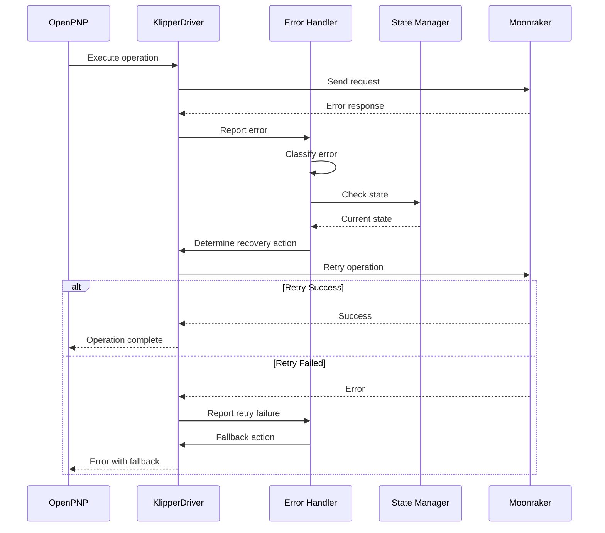

# KlipperPlace Architecture Design

## Executive Summary

KlipperPlace is a middleware service that bridges Klipper firmware with OpenPNP 2.0, enabling Pick-and-Place (PnP) machines to leverage Klipper's real-time motion control architecture. The system runs on the same Raspberry Pi 3 host as Klipper and Moonraker, providing seamless integration through a new KlipperDriver in OpenPNP.

## System Overview



## Integration Boundaries

### 1. Moonraker Extensions Layer

**Responsibility:**
- Extend Moonraker's HTTP/WebSocket API with PnP-specific endpoints
- Bridge Klipper's MCU protocol to REST/WebSocket interfaces
- Handle GPIO input/output operations
- Provide sensor data (pressure, vacuum, temperature)
- Expose motor control capabilities

**Components:**
- `gpio_extension.py` - GPIO input/output monitoring and control
- `sensor_extension.py` - Sensor data collection (pressure, vacuum, load)
- `motor_extension.py` - Motor enable/disable and fine-grained control
- `gcode_queue_extension.py` - G-code queue management and inspection
- `position_stream_extension.py` - High-frequency position streaming (10-100Hz)

**API Endpoints:**
```
GET  /api/gpio/inputs          - Read GPIO input states
POST /api/gpio/outputs         - Set GPIO output states
GET  /api/sensors/pressure     - Read pressure sensor values
GET  /api/sensors/vacuum      - Read vacuum sensor values
GET  /api/motors/status         - Get motor status
POST /api/motors/enable         - Enable/disable motors
GET  /api/gcode/queue          - Inspect G-code queue
POST /api/gcode/cancel          - Cancel queued G-codes
GET  /api/position/stream      - Stream position data
```

### 2. Klipper Modules Layer

**Responsibility:**
- Add PnP-specific functionality to Klipper firmware
- Implement custom config sections for PnP hardware
- Handle low-level hardware communication
- Provide real-time status fields for PnP operations

**Components:**
- `pnp_gpio.py` - GPIO input/output module for MCU
- `pnp_sensor.py` - Pressure/vacuum sensor support
- `pnp_actuator.py` - PnP actuator control (vacuum pump, nozzle tips)
- `pnp_feeder.py` - Feeder control interface
- Custom config sections: `[pnp_gpio]`, `[pnp_sensor]`, `[pnp_actuator]`, `[pnp_feeder]`

**Config Examples:**
```ini
[pnp_gpio]
# GPIO input pins for sensors
pin_vacuum_sensor: PB5
pin_pressure_sensor: PB6
pin_feeder_ready: PB7

# GPIO output pins for actuators
pin_vacuum_pump: PA0
pin_nozzle_tip_1: PA1
pin_nozzle_tip_2: PA2

[pnp_sensor]
# Pressure sensor configuration
pressure_sensor_type: analog
pressure_sensor_pin: ADC0
pressure_sensor_min: 0
pressure_sensor_max: 100

# Vacuum sensor configuration
vacuum_sensor_type: digital
vacuum_sensor_threshold: 0.8

[pnp_actuator]
# Vacuum pump control
vacuum_pump_pin: PA0
vacuum_pump_on_value: 1
vacuum_pump_off_value: 0

# Nozzle tip changer
nozzle_tip_count: 4
nozzle_tip_pins: PA1,PA2,PA3,PA4
```

### 3. KlipperPlace Middleware Layer

**Responsibility:**
- Coordinate communication between OpenPNP, Moonraker, and Klipper
- Maintain system state and synchronization
- Provide unified API for OpenPNP
- Handle error recovery and fault tolerance
- Manage connection lifecycle

**Components:**
- `api_server.py` - REST API server (Flask/FastAPI)
- `websocket_server.py` - WebSocket server for real-time updates
- `state_manager.py` - Centralized state management
- `error_handler.py` - Error detection and recovery
- `connection_pool.py` - Connection management to Moonraker
- `message_queue.py` - Asynchronous message handling

**Architecture Pattern:**
- Event-driven architecture with pub/sub messaging
- State machine for connection and operation states
- Circuit breaker pattern for fault tolerance
- Retry logic with exponential backoff

### 4. OpenPNP API Layer

**Responsibility:**
- Implement KlipperDriver extending GcodeDriver
- Translate OpenPNP operations to KlipperPlace API calls
- Handle driver-specific configuration and setup
- Provide OpenPNP UI integration

**Components:**
- `KlipperDriver.java` - Main driver class
- `KlipperDriverSettings.java` - Configuration UI
- `KlipperDriverGcodes.java` - G-code template management
- `KlipperDriverSolutions.java` - Issues and solutions

**Driver Commands:**
```java
// Extend GcodeDriver.CommandType enum
KLIPPER_GPIO_READ,
KLIPPER_GPIO_WRITE,
KLIPPER_SENSOR_READ_PRESSURE,
KLIPPER_SENSOR_READ_VACUUM,
KLIPPER_MOTOR_ENABLE,
KLIPPER_MOTOR_DISABLE,
KLIPPER_GCODE_QUEUE_INSPECT,
KLIPPER_GCODE_QUEUE_CANCEL,
KLIPPER_POSITION_STREAM_START,
KLIPPER_POSITION_STREAM_STOP
```

## Data Flow Diagrams

### 1. GPIO Input Monitoring Flow



### 2. Vacuum Pump Control Flow



### 3. G-code Queue Management Flow

```mermaid
sequenceDiagram
    participant OP as OpenPNP
    participant KD as KlipperDriver
    participant KM as KlipperPlace Middleware
    participant ME as Moonraker G-code Queue Extension
    participant KF as Klipper Firmware

    OP->>KD: Send G-code command
    KD->>KM: POST /api/gcode/queue
    KM->>ME: Queue G-code
    ME->>KF: Send G-code to MCU
    ME-->>KM: Return queue status
    KM-->>KD: Return queue info
    KD-->>OP: Update queue display
    
    Note over OP,KD,KM,ME,KF: Monitor queue state
    OP->>KD: Request queue inspection
    KD->>KM: GET /api/gcode/queue
    KM->>ME: Get queue status
    ME-->>KM: Return queue details
    KM-->>KD: Return queue data
    KD-->>OP: Display queue state
```

### 4. Position Streaming Flow



## API Endpoint Organization

### KlipperPlace Middleware REST API

**Base URL:** `http://localhost:7125`

**GPIO Endpoints:**
```
GET  /api/v1/gpio/inputs
    Description: Read all GPIO input states
    Response: { "inputs": { "PB5": 1, "PB6": 0, ... } }

POST /api/v1/gpio/outputs
    Description: Set GPIO output states
    Body: { "outputs": { "PA0": 1, "PA1": 0, ... } }
    Response: { "success": true }

GET  /api/v1/gpio/input/{pin_name}
    Description: Read specific GPIO input
    Response: { "pin": "PB5", "state": 1 }

POST /api/v1/gpio/output/{pin_name}
    Description: Set specific GPIO output
    Body: { "state": 1 }
    Response: { "success": true }
```

**Sensor Endpoints:**
```
GET  /api/v1/sensors/pressure
    Description: Read pressure sensor value
    Response: { "pressure": 85.5, "unit": "kPa" }

GET  /api/v1/sensors/vacuum
    Description: Read vacuum sensor value
    Response: { "vacuum": 0.92, "unit": "bar" }

GET  /api/v1/sensors/all
    Description: Read all sensor values
    Response: { "pressure": 85.5, "vacuum": 0.92, ... }
```

**Motor Control Endpoints:**
```
GET  /api/v1/motors/status
    Description: Get all motor status
    Response: { "motors": { "stepper_x": "enabled", "stepper_y": "disabled", ... } }

POST /api/v1/motors/enable
    Description: Enable specific motor
    Body: { "motor": "stepper_x" }
    Response: { "success": true }

POST /api/v1/motors/disable
    Description: Disable specific motor
    Body: { "motor": "stepper_x" }
    Response: { "success": true }

POST /api/v1/motors/enable-all
    Description: Enable all motors
    Response: { "success": true }

POST /api/v1/motors/disable-all
    Description: Disable all motors
    Response: { "success": true }
```

**G-code Queue Endpoints:**
```
GET  /api/v1/gcode/queue
    Description: Inspect G-code queue
    Response: { 
        "queue": [
            { "id": 1, "gcode": "G0 X100 Y100", "status": "pending" },
            { "id": 2, "gcode": "G0 Z50", "status": "executing" }
        ],
        "count": 2
    }

POST /api/v1/gcode/cancel
    Description: Cancel queued G-codes
    Body: { "id": 1 }
    Response: { "success": true }

DELETE /api/v1/gcode/queue
    Description: Clear entire queue
    Response: { "success": true }
```

**Position Streaming Endpoints:**
```
GET /api/v1/position/stream
    Description: Start WebSocket position stream
    Protocol: WebSocket
    Response format: { "x": 100.5, "y": 50.2, "z": 10.0, "timestamp": 1234567890 }
```

**System Status Endpoints:**
```
GET  /api/v1/system/status
    Description: Get overall system status
    Response: {
        "moonraker_connected": true,
        "klipper_connected": true,
        "motors_enabled": true,
        "queue_size": 5,
        "sensors": { ... }
    }

GET  /api/v1/system/health
    Description: Health check endpoint
    Response: { "status": "healthy", "version": "1.0.0" }
```

### OpenPNP KlipperDriver Configuration

**Driver Settings:**
```java
@Element(required = false)
protected String klipperPlaceUrl = "http://localhost:7125";

@Element(required = false)
protected int positionStreamFrequency = 50; // Hz

@Element(required = false)
protected boolean enablePositionStreaming = true;

@Element(required = false)
protected int gpioPollInterval = 100; // ms

@Element(required = false)
protected int connectionTimeout = 5000; // ms
```

## State Management Strategy

### State Architecture



### State Components

**1. Connection State:**
- Tracks connection status to Moonraker and Klipper
- Manages reconnection logic with exponential backoff
- Circuit breaker pattern to prevent cascading failures

**2. Motor State:**
- Tracks enabled/disabled status of all motors
- Synchronizes state across OpenPNP, Moonraker, and Klipper
- Persists state for recovery scenarios

**3. GPIO State:**
- Maintains current GPIO input/output states
- Provides change notifications via WebSocket
- Debounces input signals to prevent false triggers

**4. Queue State:**
- Tracks G-code queue status and contents
- Monitors queue depth and execution progress
- Provides queue inspection and cancellation capabilities

**5. Sensor State:**
- Caches latest sensor readings
- Provides historical data for trends
- Handles sensor calibration and validation

### State Synchronization

**Principles:**
- Single source of truth: Klipper firmware
- Eventual consistency across all layers
- Optimistic updates with rollback on failure
- Conflict resolution with last-write-wins strategy

**Synchronization Flow:**
```mermaid
sequenceDiagram
    participant OP as OpenPNP
    participant KD as KlipperDriver
    participant SM as State Manager
    participant MR as Moonraker
    participant KF as Klipper

    OP->>KD: Update motor state
    KD->>SM: Request state change
    SM->>MR: Apply change
    MR->>KF: Send command
    KF-->>MR: Acknowledge
    MR-->>SM: Confirm state
    SM-->>KD: Update cached state
    KD-->>OP: Confirm operation
    
    Note over OP,KD,SM,MR,KF: Background sync
    KF->>MR: Status update
    MR->>SM: State notification
    SM->>KD: Push state update
    KD->>OP: Update UI
```

## Error Handling and Recovery

### Error Categories

**1. Connection Errors:**
- Moonraker unreachable
- Klipper not responding
- WebSocket disconnection

**2. Communication Errors:**
- Timeout waiting for response
- Invalid response format
- Command execution failure

**3. Hardware Errors:**
- Motor stall detected
- Sensor out of range
- GPIO fault

**4. State Errors:**
- State synchronization failure
- Queue corruption
- Inconsistent state across layers

### Error Handling Strategy

**Circuit Breaker Pattern:**


**Implementation:**
- Track failure count and success rate
- Open circuit after N consecutive failures
- Half-open state allows test requests
- Close circuit after M consecutive successes

**Retry Logic:**
- Exponential backoff: 1s, 2s, 4s, 8s, 16s
- Max retry attempts: 5
- Jitter: Add random delay to prevent thundering herd
- Dead letter queue: Log failed operations for manual review

**Error Recovery:**


**Fallback Actions:**
- GPIO operations: Cache last known state
- Motor operations: Report error, don't retry
- Queue operations: Clear queue, notify user
- Sensor operations: Return cached value, flag as stale

## Implementation Roadmap

### Phase 1: Foundation (Priority 1)

**Dependencies:** None

**Tasks:**
1. Set up KlipperPlace middleware project structure
2. Implement basic REST API server
3. Implement WebSocket server
4. Implement connection pool to Moonraker
5. Implement basic state manager
6. Implement error handler framework

**Deliverables:**
- Running middleware service
- Health check endpoint
- Basic state management

### Phase 2: Moonraker Extensions (Priority 1)

**Dependencies:** Phase 1 complete

**Tasks:**
1. Implement GPIO input/output extension
2. Implement sensor extension (pressure, vacuum)
3. Implement motor control extension
4. Implement G-code queue extension
5. Implement position streaming extension
6. Create Moonraker extension configuration

**Deliverables:**
- GPIO input monitoring
- GPIO output control
- Sensor data collection
- Motor enable/disable
- G-code queue inspection
- Position streaming

### Phase 3: OpenPNP KlipperDriver (Priority 1)

**Dependencies:** Phase 2 complete

**Tasks:**
1. Create KlipperDriver class extending GcodeDriver
2. Implement driver configuration UI
3. Implement G-code command templates
4. Implement GPIO read/write commands
5. Implement sensor read commands
6. Implement motor control commands
7. Implement queue inspection commands
8. Implement position streaming client
9. Implement error handling and recovery
10. Create driver documentation

**Deliverables:**
- Functional KlipperDriver
- Configuration UI
- Integration with OpenPNP 2.0

### Phase 4: Integration and Testing (Priority 2)

**Dependencies:** Phase 3 complete

**Tasks:**
1. End-to-end integration testing
2. Performance testing
3. Stress testing
4. Error recovery testing
5. User acceptance testing
6. Documentation completion

**Deliverables:**
- Test reports
- Performance benchmarks
- User documentation
- Deployment guide

### Phase 5: Advanced Features (Priority 3)

**Dependencies:** Phase 4 complete

**Tasks:**
1. Implement feeder control
2. Implement nozzle tip changer
3. Implement advanced sensor types
4. Implement multi-MCU support
5. Implement backup/restore state
6. Implement analytics and monitoring

**Deliverables:**
- Full PnP feature set
- Monitoring dashboard
- Backup/restore functionality

## Testing Strategy

### Unit Testing

**Scope:** Individual components

**Coverage:**
- Middleware API endpoints
- State manager logic
- Error handler recovery
- KlipperDriver commands

**Tools:**
- pytest for Python components
- JUnit for Java components
- Mocking for external dependencies

### Integration Testing

**Scope:** Component interactions

**Test Cases:**
- OpenPNP to KlipperPlace communication
- KlipperPlace to Moonraker communication
- Moonraker to Klipper communication
- State synchronization across all layers
- Error propagation and recovery

**Tools:**
- Integration test suite
- Testcontainers for Moonraker/Klipper
- Test OpenPNP with mock driver

### System Testing

**Scope:** End-to-end workflows

**Test Scenarios:**
- Complete pick-and-place operation
- GPIO input monitoring and response
- Vacuum pump control
- G-code queue management
- Position streaming during motion
- Connection failure and recovery
- Concurrent operations

**Tools:**
- Manual testing on hardware
- Automated test scripts
- Performance monitoring

### Performance Testing

**Metrics:**
- API response time
- WebSocket message latency
- Position streaming frequency
- G-code queue throughput
- Memory usage
- CPU utilization

**Targets:**
- API response < 100ms
- WebSocket latency < 50ms
- Position streaming 50-100Hz
- G-code queue > 100 commands/second
- Memory < 500MB
- CPU < 50%

### Security Testing

**Scope:**
- API authentication
- Input validation
- SQL injection prevention
- XSS prevention
- CSRF protection

**Tools:**
- Security scanning tools
- Penetration testing
- Code review

## Deployment Architecture

### System Requirements

**Hardware:**
- Raspberry Pi 3 or 4
- 2GB RAM minimum, 4GB recommended
- 16GB storage minimum

**Software:**
- Python 3.8+
- Klipper firmware
- Moonraker
- OpenPNP 2.0
- Systemd for service management

### Deployment Structure

```
/opt/klipperplace/
├── klipperplace/          # Main application
├── config/                   # Configuration files
│   ├── klipperplace.conf
│   └── logging.conf
├── logs/                     # Log files
├── data/                     # Persistent data
│   └── state.db
└── scripts/                   # Utility scripts
    ├── install.sh
    ├── update.sh
    └── backup.sh
```

### Service Configuration

**Systemd Service:**
```ini
[Unit]
Description=KlipperPlace Middleware
After=moonraker.service
Requires=moonraker.service

[Service]
Type=simple
User=pi
WorkingDirectory=/opt/klipperplace
ExecStart=/usr/bin/python3 /opt/klipperplace/main.py
Restart=always
RestartSec=10

[Install]
WantedBy=multi-user.target
```

**Environment Variables:**
```bash
KLIPPERPLACE_CONFIG=/opt/klipperplace/config/klipperplace.conf
KLIPPERPLACE_LOG_LEVEL=INFO
KLIPPERPLACE_PORT=7125
MOONRAKER_URL=http://localhost:7125
```

## Monitoring and Observability

### Logging

**Levels:**
- DEBUG: Detailed diagnostic information
- INFO: Normal operation events
- WARNING: Unexpected but recoverable events
- ERROR: Error conditions
- CRITICAL: System failure events

**Log Format:**
```json
{
    "timestamp": "2024-01-13T19:00:00Z",
    "level": "INFO",
    "component": "api_server",
    "message": "Request received",
    "request_id": "abc123",
    "details": { ... }
}
```

### Metrics

**Collected Metrics:**
- Request count and latency
- Error rate by type
- Connection status
- Queue depth
- Motor state changes
- GPIO state changes
- Sensor readings
- Memory and CPU usage

**Metrics Export:**
- Prometheus format for monitoring
- Grafana dashboard integration
- Alert thresholds

### Health Checks

**Endpoints:**
- `/api/v1/system/health` - Basic health check
- `/api/v1/system/ready` - Readiness check
- `/api/v1/system/status` - Detailed status

**Health Indicators:**
- Moonraker connection status
- Klipper connection status
- API response time
- Error rate
- Resource utilization

## Security Considerations

### Authentication

**Current:** No authentication (local network)
**Future:** API key authentication
**Implementation:**
- API key in configuration
- X-API-Key header validation
- Key rotation support

### Input Validation

**Principles:**
- Validate all input parameters
- Sanitize GPIO pin names
- Validate sensor ranges
- Limit G-code queue size

### Rate Limiting

**Endpoints:**
- API: 1000 requests/second
- WebSocket: 100 connections
- Position stream: 1 per connection

### Network Security

**Measures:**
- Bind to localhost only (default)
- Optional external binding with firewall
- TLS support for external access

## Conclusion

This architecture provides a robust, scalable foundation for integrating Klipper firmware with OpenPNP 2.0 for Pick-and-Place applications. The clear separation of concerns, comprehensive error handling, and phased implementation approach ensure maintainability and reliability.

Key strengths:
- Modular design allowing independent component development
- Clear integration boundaries reducing coupling
- Comprehensive state management ensuring consistency
- Robust error handling with automatic recovery
- Scalable architecture supporting future enhancements

Next steps involve reviewing this architecture with stakeholders and beginning implementation starting with Phase 1.
